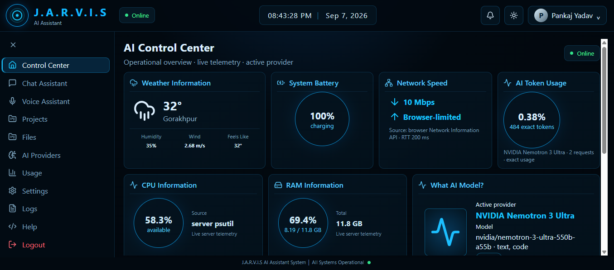
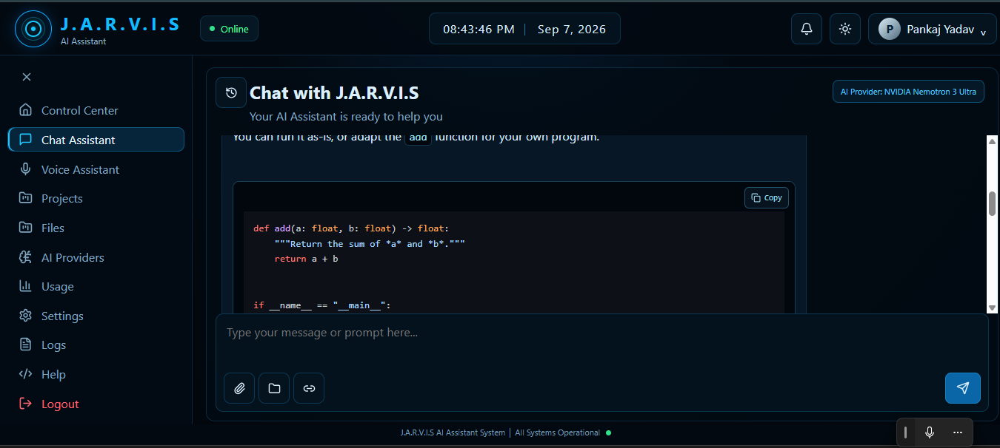
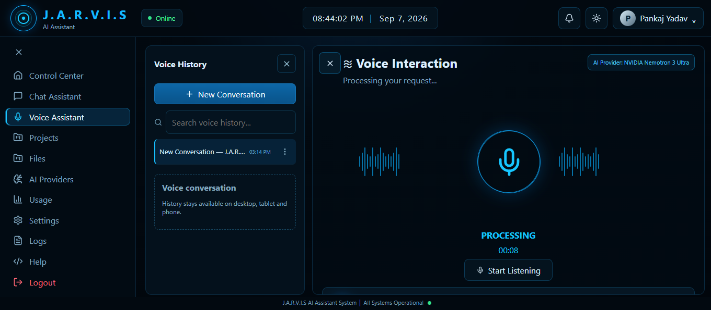
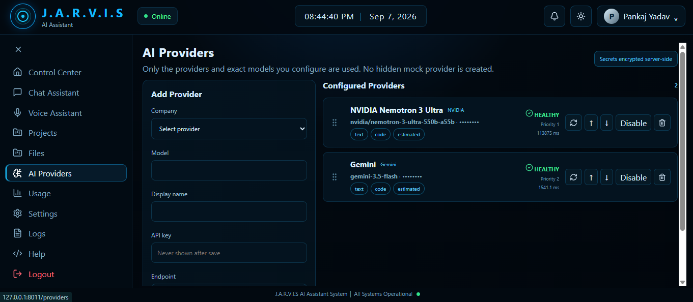
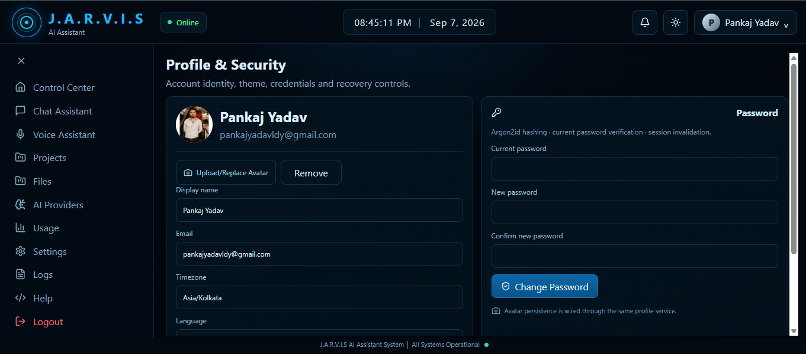

# PA NEXUS V3 --- J.A.R.V.I.S AI Assistant

> **PA NEXUS** is a desktop-first personal AI assistant platform with a
> J.A.R.V.I.S-style interface. It combines AI chat, voice interaction,
> configurable AI providers, projects, file uploads, weather,
> usage/routing information, alerts, profile/security controls, and a
> local FastAPI backend.



## 📌 What is PA NEXUS?

PA NEXUS is designed as a **personal AI operating assistant** rather
than a simple chatbot.

The application has two major layers:

-   **Frontend:** React + TypeScript + Vite desktop-style interface.
-   **Backend:** FastAPI + SQLAlchemy + Alembic service that stores
    application data locally and communicates with configured AI
    providers.

The main idea is:

``` text
You
 │
 ▼
J.A.R.V.I.S UI
 │
 ├── Control Center
 ├── Chat Assistant
 ├── Voice Assistant
 ├── Projects
 ├── Files
 ├── AI Providers
 ├── Usage & Routing
 ├── Settings
 └── Profile & Security
 │
 ▼
FastAPI Backend
 │
 ├── Authentication & Sessions
 ├── Conversations & Messages
 ├── Provider Routing
 ├── Provider Health Checks
 ├── Context Capsules
 ├── File Validation
 ├── Weather
 └── Usage Tracking
 │
 ▼
Configured AI Provider
 ├── OpenAI
 ├── Gemini
 ├── Anthropic
 ├── NVIDIA
 └── Custom OpenAI-compatible provider
```

Only providers explicitly configured by the user are intended to
participate in AI routing. There is no hidden mock AI provider.

------------------------------------------------------------------------

# ✨ Main Features

## 1. AI Control Center

The Control Center is the application's operational dashboard.

It presents:

-   Weather information
-   System battery state
-   Network information
-   AI token usage
-   CPU information
-   RAM information
-   Active AI provider/model
-   File and folder upload entry points
-   System overview

The dashboard distinguishes between **real telemetry, estimated values,
and unavailable values** rather than pretending that screenshot values
are live data.


### When would you use it?

Use the Control Center when you want a quick overview of:

> "What is my system doing right now, which AI model is active, and what
> is the current operational state?"

------------------------------------------------------------------------

# 💬 2. Chat Assistant

The Chat Assistant is the main text-based AI interaction area.

It supports:

-   Conversation history
-   New conversations
-   User/assistant messages
-   Markdown responses
-   Syntax-highlighted code
-   Copy-code controls
-   Provider/model visibility
-   File/link attachment controls
-   Waiting state while an AI provider processes a request



### Typical workflow

``` text
1. Open Chat Assistant
2. Create/select a conversation
3. Type a question
4. Press Enter or Send
5. Your message appears immediately
6. J.A.R.V.I.S waits for the provider response
7. The configured AI provider generates the answer
8. The answer is stored in conversation history
```

Example:

``` text
User:
Explain Python functions with a simple example.

J.A.R.V.I.S:
A Python function is a reusable block of code...
```

The chat layer is backed by the FastAPI chat endpoint and
provider-routing service.

------------------------------------------------------------------------

# 🎙️ 3. Voice Assistant

Voice Assistant is deliberately separated from Chat Assistant so voice
conversations have their own history and interaction state.

It provides:

-   Voice conversation history
-   New voice conversations
-   Search within voice history
-   Central microphone interaction
-   Processing state
-   Voice waveform/ring visual language
-   Provider/model visibility



### Typical workflow

``` text
Start Listening
      ↓
Capture voice input
      ↓
Process request
      ↓
Send request through configured AI provider
      ↓
Receive AI response
      ↓
Continue the voice conversation
```

Browser microphone permissions are required for browser-dependent voice
functionality.

------------------------------------------------------------------------

# 🤖 4. AI Provider Management

AI Providers is one of the most important parts of PA NEXUS.

The user can configure a provider by supplying:

-   Company/provider
-   Exact model name
-   Display name
-   API key
-   Optional endpoint

Supported provider choices in the current UI include:

-   OpenAI
-   Gemini
-   Anthropic
-   NVIDIA
-   Custom



## Provider health

Every configured provider has a health state:

``` text
UNCONFIGURED
     │
     ▼
Configured
     │
     ▼
Test exact endpoint + model + credential
     │
 ┌───┴───────────────┐
 ▼                   ▼
HEALTHY           UNHEALTHY
```

A provider becomes **HEALTHY only after the application successfully
verifies the configured provider/model request**.

The application also records:

-   Priority
-   Enabled/disabled state
-   Provider capabilities
-   Test information
-   Latency where available
-   Usage source

## Provider routing

When multiple providers are configured, routing considers:

-   Enabled state
-   Provider health
-   Required capability
-   Preferred provider
-   Priority

Conceptually:

``` text
Chat request
     │
     ▼
Find enabled providers
     │
     ▼
Keep providers with required capability
     │
     ▼
Keep HEALTHY providers
     │
     ▼
Preferred provider / priority
     │
     ▼
Send request
     │
     ├── Success → return answer
     │
     └── Failure → try another configured healthy provider when eligible
```

There is no silent fallback to a hidden `jarvis-mock-1` model.

------------------------------------------------------------------------

# 👤 5. Profile & Security

The Profile & Security page manages the user's account identity and
security controls.

It includes:

-   Display name
-   Email
-   Timezone
-   Language
-   Avatar upload/replacement
-   Avatar removal
-   Current password verification
-   Password change



### Security approach

The backend is designed around:

-   Argon2id password hashing
-   Server-side encryption for provider credentials
-   HTTP-only session cookies
-   User ownership filtering
-   Upload extension/MIME/size validation
-   No API-key display after saving
-   No credentials intentionally printed to logs

------------------------------------------------------------------------

# 📁 6. Files

The Files module provides controlled local uploads.

Supported examples include:

-   PDF
-   DOCX
-   TXT
-   CSV
-   XLSX
-   JSON
-   PNG
-   JPG/JPEG
-   WEBP

The current application enforces a maximum upload size of **50 MB**.

Files are validated by extension, MIME type, size, and filename before
being stored.

------------------------------------------------------------------------

# 🗂️ 7. Projects

Projects provide a structured place to organize work around a particular
goal.

A project can contain:

-   Requirements
-   Tasks
-   Decisions
-   Bugs
-   Notes
-   Memory
-   Conversations
-   Files
-   Architecture information

Example:

``` text
PA NEXUS
├── Requirements
├── Tasks
├── Architecture
├── Decisions
├── Bugs
├── Notes
└── Memory
```

This is useful when PA NEXUS is being used for a long-running software
or research project instead of a single chat.

------------------------------------------------------------------------

# 🌦️ 8. Settings & Weather

Settings contains:

-   Weather provider configuration
-   Location
-   Metric/imperial units
-   Encrypted weather API key storage
-   Live weather testing
-   Dark/light theme selection

Theme changes are applied immediately and persist in the browser.

------------------------------------------------------------------------

# 📊 9. Usage & Routing

The Usage page explains provider routing and quota-related thresholds.

The current interface distinguishes usage sources such as:

-   Exact
-   Estimated
-   Unavailable

The routing layer is capability-aware and uses provider health,
capability, enabled state, preference, and priority.

------------------------------------------------------------------------

# 🔐 Security & Secrets

**Never commit real API keys to GitHub.**

The repository includes `.env.example`, while `.env` is ignored by Git.

Example:

``` env
PA_NEXUS_SECRET_KEY=replace-with-a-long-random-secret
DATABASE_URL=
CORS_ORIGINS=http://127.0.0.1:8011,http://localhost:8011
SESSION_TTL_HOURS=24
MAX_UPLOAD_MB=50
```

Create your own local `.env` from `.env.example`.

### Never commit

``` text
.env
*.db
.venv/
node_modules/
dist/
logs/
real API keys
passwords
session cookies
```

The included `.gitignore` already excludes the common runtime/secrets.

------------------------------------------------------------------------

# 🏗️ Architecture

PA NEXUS follows a frontend/backend separation:

``` text
frontend/
  React UI
      │
      ▼
  API service layer
      │
      ▼
backend/
  FastAPI routes
      │
      ├── Authentication
      ├── Conversations
      ├── Providers
      ├── Routing
      ├── Files
      ├── Projects
      ├── Weather
      └── Usage
      │
      ▼
  SQLAlchemy models
      │
      ▼
  SQLite database
```

## Technology stack

  Layer                   Technology
  ----------------------- -------------------------------------
  UI                      React 18
  Language                TypeScript
  Frontend build          Vite
  Routing                 React Router
  Icons                   Lucide React
  Markdown                React Markdown
  Backend                 FastAPI
  ORM                     SQLAlchemy 2
  Database                SQLite
  Migrations              Alembic
  Password hashing        Argon2id
  Credential encryption   Fernet-based server-side encryption
  HTTP client             HTTPX
  Testing                 Pytest / Vitest setup
  Containerization        Docker

------------------------------------------------------------------------

# 📂 Project Structure

``` text
PA_NEXUS_V3_RELEASE_3_0_14/
│
├── backend/
│   └── app/
│       ├── auth/
│       ├── capsule/
│       ├── config/
│       ├── conversations/
│       ├── database/
│       ├── files/
│       ├── monitoring/
│       ├── notifications/
│       ├── projects/
│       ├── providers/
│       ├── routing/
│       ├── security/
│       ├── usage/
│       ├── voice/
│       ├── weather/
│       ├── models.py
│       └── main.py
│
├── frontend/
│   ├── src/
│   │   ├── components/
│   │   ├── features/
│   │   │   ├── chat/
│   │   │   ├── providers/
│   │   │   ├── profile/
│   │   │   └── voice/
│   │   ├── layouts/
│   │   ├── pages/
│   │   ├── services/
│   │   ├── stores/
│   │   ├── styles/
│   │   └── main.tsx
│   ├── package.json
│   └── tsconfig*.json
│
├── docs/
│   ├── ARCHITECTURE.md
│   ├── RUNTIME.md
│   ├── VALIDATION_REPORT.md
│   ├── V3_MASTER_PROMPT.md
│   ├── V3_PROVIDER_ROUTING_SPEC.md
│   ├── V3_UI_ACCEPTANCE_MATRIX.md
│   └── screenshots/
│
├── tests/
├── scripts/
├── docker/
├── data/
├── uploads/
├── logs/
├── .env.example
├── .gitignore
├── docker-compose.yml
├── run.bat
├── run.ps1
├── run.sh
└── README.md
```

------------------------------------------------------------------------

# 💻 Installation --- Beginner Guide

## Requirements

Recommended:

-   Windows 10/11
-   Python 3.14.x
-   Node.js 22.x
-   npm
-   Git

Supported ranges:

-   Python **3.11--3.14**
-   Node **20--22**

Check versions:

``` bash
python --version
node --version
npm --version
git --version
```

------------------------------------------------------------------------

# ▶️ Run on Windows

The easiest method is:

``` bat
run.bat
```

Run it from the project directory.

The runner:

1.  Finds the project root.
2.  Creates/uses `.venv`.
3.  Installs backend dependencies.
4.  Runs database migrations.
5.  Enters the frontend directory.
6.  Installs frontend dependencies.
7.  Runs TypeScript checking.
8.  Builds the Vite frontend.
9.  Verifies the production frontend.
10. Starts FastAPI.

The local application runs on:

``` text
http://127.0.0.1:8011
```

You can also use:

``` text
http://localhost:8011
```

------------------------------------------------------------------------

# 🐍 Manual Backend Setup

If you want to understand what the runner is doing:

``` bat
python -m venv .venv
.venv\Scripts\activate
python -m pip install --upgrade pip
pip install -r backend\requirements.txt
```

Run migrations:

``` bat
alembic -c backend\alembic.ini upgrade head
```

Start FastAPI:

``` bat
uvicorn backend.app.main:app --host 127.0.0.1 --port 8011
```

------------------------------------------------------------------------

# ⚛️ Manual Frontend Setup

Open another terminal:

``` bat
cd frontend
npm install
npm run typecheck
npm run build
```

For development mode:

``` bat
npm run dev
```

------------------------------------------------------------------------

# 🔑 Adding Your First AI Provider

1.  Start PA NEXUS.
2.  Create/log in to your local account.
3.  Open **AI Providers**.
4.  Select the provider company.
5.  Enter the **exact model name** supplied by that provider.
6.  Enter a display name.
7.  Enter the API key.
8.  Enter the endpoint only when required or when using a custom
    endpoint.
9.  Save the provider.
10. Run the provider test.
11. Confirm that it becomes `HEALTHY`.
12. Open Chat Assistant.

Example NVIDIA configuration:

``` text
Company:
NVIDIA

Model:
nvidia/nemotron-3-ultra-550b-a55b

Display name:
NVIDIA Nemotron 3 Ultra

Endpoint:
https://integrate.api.nvidia.com/v1

API key:
YOUR_NVIDIA_API_KEY
```

Use your own provider credentials. Never publish them in the repository.

------------------------------------------------------------------------

# 🧪 Testing

Backend and architecture tests are located in:

``` text
tests/
```

A typical backend test command is:

``` bat
set PYTHONPATH=backend
pytest -q tests/backend tests/security tests/architecture tests/runner_test.py tests/ten_cycle_qa.py
```

Python compilation check:

``` bat
python -m compileall -q backend/app
```

Frontend checks:

``` bat
cd frontend
npm run typecheck
npm run build
```

## Validation honesty

The repository includes a validation report.

The release records backend, migration, architecture, security, runner,
and API validation performed in the build environment. Real external
provider health depends on the user's network, provider account, API
key, quota, model access, and endpoint.

Real browser acceptance and real provider calls are
environment-dependent and should be verified on the machine where the
application is deployed.

------------------------------------------------------------------------

# 🛠️ Troubleshooting

## Provider shows UNHEALTHY

Check:

``` text
1. Is the API key valid?
2. Is the key active?
3. Does the account have API access/credits/quota?
4. Is the exact model name correct?
5. Is the endpoint correct?
6. Does the local machine have internet access?
7. Is a firewall/proxy blocking the request?
8. Is the provider temporarily rate-limiting the request?
```

The terminal prints provider diagnostics without intentionally printing
the secret key.

Look for:

``` text
[PROVIDER TEST]
```

or:

``` text
[PROVIDER CHAT ERROR]
```

Useful diagnostic categories include:

``` text
authentication
model_or_endpoint
rate_limit_or_quota
request_rejected
provider_server_error
network
unexpected
```

### Slow reasoning models

Some reasoning models can take considerably longer than a simple chat
model.

If the terminal reports a timeout, first inspect the exact diagnostic
line. Do not immediately assume that the API key is wrong.

------------------------------------------------------------------------

# 🧹 If an old version is still opening

If you previously ran another PA NEXUS release:

1.  Stop the old terminal/server.
2.  Close the browser tab.
3.  Extract the new release into a fresh directory.
4.  Run the new `run.bat`.
5.  Open `http://127.0.0.1:8011`.
6.  If the browser still shows stale assets, perform a hard refresh.

Chrome hard refresh:

``` text
Ctrl + Shift + R
```

------------------------------------------------------------------------

# 🐳 Docker

The repository also includes:

``` text
docker/
docker-compose.yml
```

Use Docker when you want a containerized runtime instead of the Windows
local runner.

------------------------------------------------------------------------

# 🌐 GitHub --- Push This Project

The following steps are written for a beginner.

## Step 1 --- Install Git

Check:

``` bash
git --version
```

If it prints a version, Git is installed.

------------------------------------------------------------------------

## Step 2 --- Create a GitHub repository

On GitHub:

1.  Sign in.
2.  Click **New repository**.
3.  Give it a name, for example:

``` text
PA-NEXUS
```

4.  Choose Public or Private.
5.  If you already have this local project, it is simplest to create the
    repository without adding another README initially.
6.  Create the repository.

------------------------------------------------------------------------

## Step 3 --- Open terminal in the PA NEXUS root

Example:

``` bat
cd "E:\Personal Assistant\PA_NEXUS_V3_RELEASE_3_0_14\PA_NEXUS_V3_RELEASE_3_0_14"
```

Use your actual project path if it is different.

Confirm:

``` bat
dir
```

You should see:

``` text
backend
frontend
docs
tests
run.bat
README.md
.gitignore
```

------------------------------------------------------------------------

## Step 4 --- Initialize Git

``` bash
git init
```

Set your Git identity if Git asks:

``` bash
git config --global user.name "Your Name"
git config --global user.email "your-email@example.com"
```

------------------------------------------------------------------------

## Step 5 --- Check what will be committed

``` bash
git status
```

Before continuing, make sure you do **not** see:

``` text
.env
.venv
node_modules
*.db
real API keys
```

------------------------------------------------------------------------

## Step 6 --- Add the files

``` bash
git add .
```

Then:

``` bash
git status
```

------------------------------------------------------------------------

## Step 7 --- Create the first commit

``` bash
git commit -m "Initial PA NEXUS V3 release"
```

------------------------------------------------------------------------

## Step 8 --- Connect GitHub

Copy your own GitHub repository URL.

Example:

``` bash
git remote add origin https://github.com/YOUR_USERNAME/PA-NEXUS.git
```

Verify:

``` bash
git remote -v
```

------------------------------------------------------------------------

## Step 9 --- Push

``` bash
git branch -M main
git push -u origin main
```

GitHub may ask you to authenticate through your browser/Git Credential
Manager.

------------------------------------------------------------------------

# 🔄 Future Updates

After changing the project:

``` bash
git status
git add .
git commit -m "Fix chat and provider routing"
git push
```

The normal workflow is:

``` text
Edit code
   ↓
git status
   ↓
git add .
   ↓
git commit -m "..."
   ↓
git push
   ↓
GitHub updated
```

------------------------------------------------------------------------

# 🚨 Very Important: API Key Safety

Never do this:

``` python
api_key = "sk-..."
```

inside a file that will be committed to GitHub.

Never paste API keys into:

-   README.md
-   screenshots
-   source code
-   GitHub Issues
-   GitHub Discussions
-   public logs

If an API key has accidentally been exposed publicly:

1.  Revoke/rotate it at the provider.
2.  Create a new key.
3.  Update your local configuration.
4.  Search Git history for the leaked key.
5.  Treat the key as compromised even after deleting the latest file.

------------------------------------------------------------------------

# 📜 Development Philosophy

PA NEXUS follows several important principles.

### Explicit state

The UI should clearly distinguish:

``` text
HEALTHY
UNHEALTHY
UNCONFIGURED
UNAVAILABLE
ESTIMATED
EXACT
```

### No fake telemetry

The application should not present screenshot values as live system
data.

### No hidden AI fallback

Only explicitly configured providers should participate in AI routing.

### Capability-aware routing

A provider must have the capability required by the current request.

### Preserve conversation identity

Provider switching should not create a new conversation identity.
Context Capsules are used as a routing foundation for preserving
conversational context.

### Secure credentials

Secrets belong on the server side and should never be rendered back to
the frontend after saving.

------------------------------------------------------------------------

# 📚 Documentation

More detailed technical documentation is available under:

``` text
docs/
```

Important documents include:

-   `ARCHITECTURE.md`
-   `RUNTIME.md`
-   `VALIDATION_REPORT.md`
-   `V3_MASTER_PROMPT.md`
-   `V3_PROVIDER_ROUTING_SPEC.md`
-   `V3_ARCHITECTURE_GATES.md`
-   `V3_UI_ACCEPTANCE_MATRIX.md`
-   `V3_REGRESSION_DEFECT_CATALOG.md`
-   `V3_BROWSER_TEST_PROTOCOL.md`
-   `RELEASE_CHECKLIST.md`

------------------------------------------------------------------------

# 📸 Screenshots

The screenshots in this README are stored in:

``` text
docs/screenshots/
```

GitHub renders these images directly from the repository, so visitors
can understand the application before installing it.

### Control Center


### Chat Assistant


### Voice Assistant


### AI Providers


### Profile & Security


------------------------------------------------------------------------

# 👨‍💻 Who is this project for?

PA NEXUS can be useful for:

-   Developers learning full-stack application architecture
-   Students learning React and FastAPI
-   AI application developers
-   People experimenting with multiple AI providers
-   Developers building personal AI assistants
-   Anyone interested in provider routing and local AI tooling

It is intentionally structured so a beginner can start with the Windows
runner and then gradually explore the frontend, backend, database,
provider adapters, and tests.

------------------------------------------------------------------------

# 📄 License

No license has been specified in the current project source.

If you plan to publish the repository publicly, choose and add an
appropriate `LICENSE` file before presenting the project as open-source.

------------------------------------------------------------------------

# ⭐ Final Summary

**PA NEXUS is a full-stack J.A.R.V.I.S-style personal AI assistant
platform.**

It combines:

``` text
🧠 AI Chat
🎙️ Voice Interaction
🤖 Multi-provider AI routing
📊 Operational dashboard
📁 Secure file uploads
🗂️ Projects
🌦️ Weather
📈 Usage information
🔐 Profile & security
🚨 Alerts
🛠️ Developer-oriented diagnostics
```

The goal is not simply to make a chatbot.

The goal is to provide a structured **personal AI operating
environment** with a clear UI, configurable providers, secure credential
handling, persistent conversations, and an architecture that can be
extended over time.

------------------------------------------------------------------------

**PA NEXUS V3 · J.A.R.V.I.S AI Assistant**
